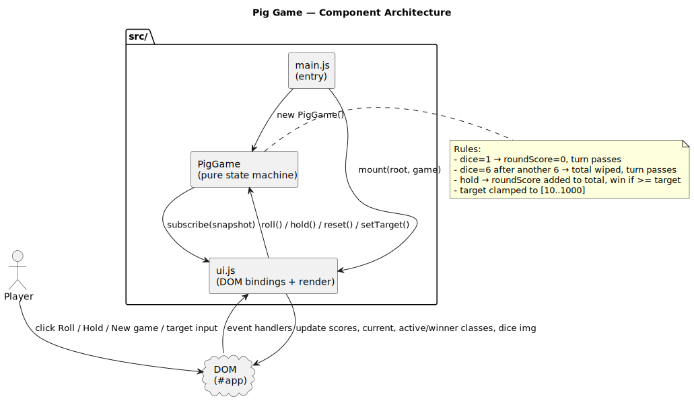
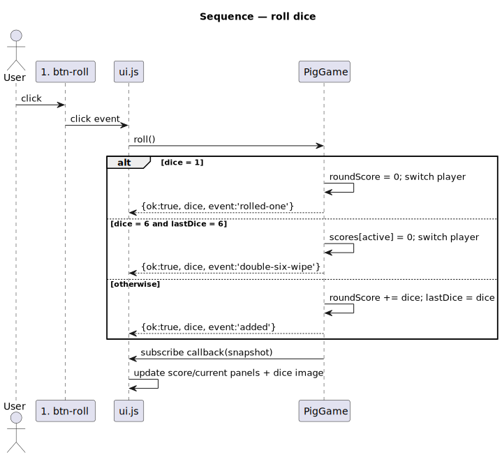
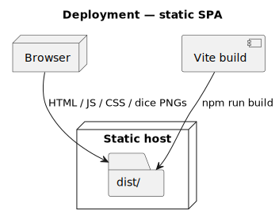

# Pig Game

Browser dice game — first player to reach the target score wins.

[](https://github.com/tzone85/jsDomPigGame/actions/workflows/ci.yml)


Originally a single `app.js` + `challenges.js` pair with module-level globals
(`var scores, roundScore, activePlayer, gamePlaying`) and three real bugs
(see below). The rewrite extracts a pure `PigGame` state machine and lets the
UI subscribe to snapshots.

## Bugs fixed during the port

| File / line (original)   | Bug                                                                                       |
|--------------------------|-------------------------------------------------------------------------------------------|
| `app.js:47`              | Win condition `>= 20` instead of `>= 100` (the comment on line 8 says "100 points wins"). Now configurable via `setTarget` + UI input. |
| `app.js:50-51`           | Adds `winner` class then *immediately* removes it — the winning panel never highlights. Fixed in the render layer; UI test asserts the class survives. |
| `app.js:11` (and challenges.js) | Module-level globals — untestable. Extracted into a `PigGame` class with private fields and a `subscribe()` API. |
| `app.js:105`             | Typo: `htmlm`.                                                                            |

## Game rules

- Two players alternate turns.
- On each turn the active player rolls a 1d6 any number of times, adding each roll to their **round** score.
- Roll a **1** → round score lost, turn passes.
- Roll a **6 twice in a row** → **total** score wiped, turn passes (bonus rule from `challenges.js`).
- **Hold** → round score added to total, turn passes.
- First to reach the configurable `target` (default 100) wins.

## Architecture







Diagrams are PlantUML under `docs/architecture/*.puml`; rendered SVGs are checked in. Regenerate with `./scripts/render_diagrams.sh`.

## Quick start

```
npm install
npm start            # vite dev server
npm run build        # produces dist/
npm run preview      # serves dist/
npm test             # vitest + coverage (90% gate on src/game/**)
npm run test:e2e     # playwright vs preview
npm run lint
```

## Project layout

```
src/
├── main.js               # entry — mounts UI on #app, exposes window.__pig
├── ui.js                 # DOM bindings + render
├── game/
│   └── pig-game.js       # PURE PigGame class
└── styles/main.css
public/                   # dice-1..6.png + back.jpg
tests/
├── unit/pig-game.test.js # 15 tests on the state machine
└── unit/ui.test.js       # 5 tests on the DOM bindings (incl. winner-class regression)
tests/e2e/play.spec.js    # 1 Playwright flow (roll/hold/winner)
docs/architecture/        # PlantUML + SVGs
.github/workflows/ci.yml
```

## Tests

| Suite                          | Count   | What                                                                                  |
|--------------------------------|---------|---------------------------------------------------------------------------------------|
| `tests/unit/pig-game.test.js`  | 15      | Initial state, target clamping, roll (added / 1 / double-6), hold (commit + win), setTarget restrictions, reset, subscribe |
| `tests/unit/ui.test.js`        | 5       | Render, roll button, hold button, winner-class regression, new-game with target input |
| `tests/e2e/play.spec.js`       | 1       | Full roll → hold flow ending in winner class or non-trivial total                     |
| **Total**                      | **21**  | 90% line / 85% branch gate on `src/game/**`                                           |

## License

MIT — see [LICENSE](LICENSE).
